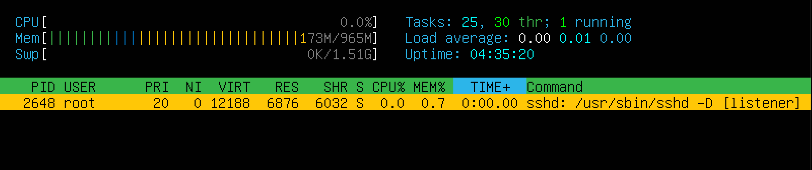
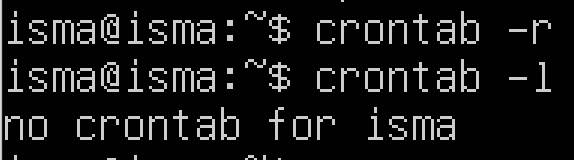

## Part 1. Installation of the OS

* Установить Ubuntu и командой "cat /etc/issue" проверить версию Ubuntu. 

## Part2. Creating a user

* Командой  "sudo useradd -m -G adm isma" добавляем пользователя "isma" в adm группу. "-G" - для указания группы.  

* Командой "cat /etc/passwd" выводим содержимое файла "passwd"

## Part3. Setting up the OS network

* Командой "sudo hostnamectl set-hostname nomaalid-1" меняем имя машины, где последний параметр "nomaalid" новое имя.

* Командой "sudo timedatectl set-timezone Europe/Moscow" устанавливаем необходимый часовой пояс.

* Командой "ls /sys/class/net" выводим имена сетевых интерфейсов.

* Командой "ip addr"  выводим параметры интерфейсов.

* 1-ая строка:
	+ MAC-address и brd(широковещательный адресс) указаны, как "00:00:00:00:00:00", так как:
		-  MAC-address - уникален для каждого сетевого интерфейса и необходим для обеспечения связи между устройствами.
		- brd(broadcast address) - для отправки данных ко всем устройствам в сети. Каждое устройство в сети имеет свой собственный IP-address и brd позволяет отправить данные всем устройствам в сети одновременно. 
		
		- Но так как lo - виртуальный интерфейс и предназначены для внутренней связи одной машины  и не требуют физического сетевого соединениея.

* 2-ая строка:
	- inet - протокол, используемый для адресации IPv4, который использует интерфайс.
	- 127.0.0.1 - адресс локальной сети.
	- /8 - Это маска подсети, указывающая на количество бит, используемых для адресации сети.
	- scope host указывает на область видимости IP-адреса.
	- valid_lft (valid lifetime) — это общее время, в течение которого адрес считается действительным.
	-  preferred_lft (preferred lifetime) — это время, в течение которого адрес считается предпочтительным для использования.
	- forever означает, что адрес будет действителен бесконечно, до тех пор, пока не будет явно удален или изменен.

* 3-ая строка:
	- inet6 ::1/128 scope host относится к IPv6-адресу интерфейса в системе Linux, используемого для локальной связи с самим компьютером.
		+ ::1: Это сам IPv6-адрес, который используется для loopback соединений. Адрес ::1 является эквивалентом 127.0.0.1 
		+ /128: Это префикс длины, указывающий количество бит в адресе, используемых для идентификации сети.
		+ scope host: Это указывает на область видимости IP-адреса. host означает, что адрес применяется к отдельному хосту и не используется для маршрутизации в сети.
	

* inet: Указывает, что адрес является IPv4-адресом.
* 10.0.2.15 - локальный адрес, полученный от DHCP-сервера.
* /24 - Это префикс длины, указывающий количество бит в адресе, используемых для идентификации сети.
* brd 10.0.2.255: Это широковещательный адрес (broadcast address), используемый для отправки пакетов всем устройствам в сети.
* scope global: Это указывает на область видимости IP-адреса.
* dynamic: Указывает, что IP-адрес был динамически присвоен, а не статически настроен. Это означает, что адрес может измениться при перезагрузке или при получении нового адреса от DHCP-сервера.
* enp0s3: Это имя интерфейса, к которому применяется адрес.

* Командой "ip route | grep default" выводим IP-address внутреннего шлюза.

* Командой "wget -q -O - ident.me" выводим внешний ip-address шлюза. 

* Командой "sudo vim /etc/netplan/00-installer-config.yaml" открываем файл конфигурация и редактируем файл.
* Командой "sudo netplan aaply" применяем внесённые изменения.

* Командой "reboot" перезагружаем виртуальную машину.
* Командой "hostname -I && ping -c 4 1.1.1.1 | grep "stat\|loss" && ping -c 4 ya.ru" пингуем удалённые хосты.

## Part4 Os update
* Командой "sudo apt full-upgrade" обновляем пакеты до последней версии.
* После завершения обновления, вводим повторно команду "sudo apt full-upgrade".

## Part5 Using the sudo command

* Команда "sudo" даёт пользователю доступ к выполнению команд требующих повышенных привелегий(root - суперпользователя), без необходимости входа в систему как суперпользователь(без ввода пароля root-пользователя).

* Командой "sudo usermod -aG sudo nomaalid" даём пользователю "nomaalid" доступ к команде "sudo".
* "su - nomaalid" меняем пользователя и далее вводим команду "sudo su"

* Вводим команду "sudo hostnamectl set-hostname nomaalid-2" для смены hostname.
* Командой "cat /etc/hostname/ выводим hostname.

## Part 6 Installing and configuring the time service.

* Командой "date" выводим время.

* Устанавливаем NTP командой "sudo apt install systemd-timesyncd".
* Активируем NTP командой "sudo timedatectl set-ntp on".
* Выводим командой "timedatectl show".

## Part7 Installing and using test editors.

* Командой "sudo apt install vim" устанавливаем vim.
* Создаём и заходим в файл, командой "vim test_vim.txt"
* Нажимаем на "i" и входим в режим редактирования и пишем свой ник.
* После чего нажимаем на "Esc" и затем "Shift + :" далее ":wq" и "Enter" выходим из vim.

* Устаналиваем редактор nano командой "sudo apt install nano"
* Командой "nano test_nano.txt" создаём и открываем файл и вписываем ник.
* Командой "Cntl + x" и затем "y" сохраняем и выходим из редактора.

* Командой "sudo apt install mcedir" устанавливаем редактор.
* Командой "mcedit test_mcedit.txt" создаём и открываем файл и вписываем ник.
* Нажимаем "Esc" далее выбираем "Yes" для сохранения и выхода из редактора.

* Командой "vim test_vim.txt" окрываем файл.
* Нажимаем "i" меняем содержимое файла и далее "Esc" -> ":q!" выходим без сохранения.

* Командой "nano test_vim.txt" открываем файл.
* Меняем содержимое файла, далее "ctrl + x" -> "n" выходим без сохранения.

* Командой "mcedit test_mcedit.txt" отрываем файл и меняем содержимое.
* Нажимаем "Ecs" и далее выбираем "No" для выхода без сохранения.

* Открываем файл редактором vim и комнадой ":s /слово" ищем нужное слово.

* Командой ":%s/'заменяемое слово'/'новое слово'" меняем нужное слово.

* Открываем файл редактором nano. Командой "ctrl + W" ищем нужное слово.

* Для замены слова вводим "ctrl + \" далее пишем слово которое будем менять -> "Enter" и слово на которое будем менять -> "Enter" -> "Y" 

* Открываем файл в mcedit. Для поиска вводим "F7", далее вводим слово которое ищем.

* Для замены слова нажимаем "F4", далее вводим слово которое необходимо поменять, нажимаем стрелку вниз и пишем новое слово.

## Part8 Installing and basic setup of the SSHD service.

* Командой "sudo apt install openssh-sever" устанавливаем службу ssh.
* Командой "sudo update-rc.d ssh default" добавляем автостарт службы SSHd.
* В файле "sshd-config" довляем строку "Port 2022".

* Командой "/etc/init.d/ssh restart" сохраняем изменения.

* Командой "ps - axfv | grep sshd" выводим наличие процесса.
	+ ps используется для отображения информации о процессах, запущенных в системе.
	+ -a — показывать все процессы.
	+ -x — включать в вывод процессы, не привязанные к терминалу.
	+ -f — полный формат вывода, который включает в себя PID, PPID, UID.
	+ -v — использовать более подробный формат вывода.
	+ grep используется для фильтрации вывода команды ps, оставляя только строки, содержащие sshd. 

* Установка "netstat" командой "sudo apt install net-tools"
* Командой "netstat -tan" выводим:

* Команда netstat -tan используется для отображения активных TCP-соединений и прослушивающих портов на компьютере.
	+ -t — показывает активные TCP-соединения.
	+ -a — показывает все соединения и прослушивающие порты.
 	+ -n — отображает адреса и порты в числовом формате, а не пытается преобразовать их в имена хостов или служб.
	
	* Столбцы:
    + "Proto" - протоколы используемы сокетом.
	+ Recv-Q - обозначает количество байтов, которые были получены и помещены в очередь на прием для программы, связанной с этим сокетом, но еще не были обработаны.
	+ Send-Q - обозначает количество байтов, которые были отправлены программой, связанной с этим сокетом, но еще не были подтверждены получением данных на другом конце соединения
	+ Local Adbress - локальный адрес (имя локального хоста) и номер порта сокета
	+ Foreign Adbress - удаленный адрес (имя удаленного хоста) и номер порта сокета
	+ State относится к различным состояниям, через которые проходит соединение между клиентом и сервером в процессе установления соединения. Эти состояния являются частью жизненного цикла TCP-соединения, начиная от установления соединения и заканчивая его закрытием.

* "sudo reboot" - перезагружаем систему.

## Part 9. Installing and using the top, htop utilities.

* Командой "top" вызываем:

* Время безотказной работы.

* Количество авторизованных пользователей.

* Общая загрузка системы.

* Общее количество процессов.

* Загрузки процессора.

* Загрузка памяти.

* pid процесса с наибольшим использованием памяти.
* Нажимаем "m" для сортировки процессов по использованию памяти.

* pid процесса, занимающего больше всего процессорного времени.
* Нажимаем "Shift + p" для сортировки процессов по использованию процессора.

* Команда "q" для выхода из "top"

* Командой "htop" выводим:

* Нажимаем "F6" и выбираем необходимую сортировку в левом столбце.

* PID sorted

* PERCENT_CPU sorted

* PERCENT_MEM sorted

* TIME sort

* Фильтруем нажитием на "F4", затем вводим "sshd"

## Part10. Using the fdisk utility.

* Запускаем команду "sudo fdisk -l"

* Имя жёсткого диска.

* Ёмкость жёсткого диска - "bytes", количество секторов - "sectors"

* Команда "free -h" чтобы узнать размер подкачки.

## Part11: Using the df utility.

* Отображение команды "df"

* Командой "df /" отображаем отчёт корневого раздела.

* Размер раздела - "1K-blocks".
* Размер занятого пространства - "Used".
* Размер свободного пространства - "Available".
* Процент использования - "Use%".
* Единица измерения - Kb.

* Вывод команды "df -Th":

Вывод корневого раздела командой "df -Th /":

* Размер раздела - "Size".
* Размер занятого пространства - "Used".
* Размер свободного пространства - "Avail".
* Процент использовантия - "Use%".
* Тип файловой системы для раздела - "Type".

## Part12: Using the du utility

* Вывод команды "du":

* Командой sudo du -s -h /home && sudo du -s -h /var && sudo du -s -h /var/log выводим размер папок:

* Командой "sudo du -sh /var/log/*" выводим размер каждого вложенного элемента "/var/log":

## Part13: Installing and using the ncdu utility.

* Устанавливаем "ncdu" командой "sudo apt install ncdu":

* Командой "sudo ncdu /home, /var, /var/log" выводим:

## Part 14. Working with system logs.

* Открываем в vim папки dmesg, syslog, auth.log

* Командой "last" выводим время последнего успешного входа, имя пользователя и метод входа:

* Командой "service sshd restart" перезапускаем службу SShd:

* Командой "sudo cat /var/log/syslog" выводим отчёт скриншота о перезапуске службы.

## Part 15. Using the CRON job scheduler.

* Устанавливаем "cron" командой "sudo apt install cron".

* Для редактирования списка задач "sudo crontab -e"
* В открывшийся файл добавляем команду для запуска uptime каждые 2 минуты, где "*/2" - 2 минуты:

* Отображаем список текущих задач "crontab - l":

* Удаляем все задачи с планировщика задач командой "crontab -r":

